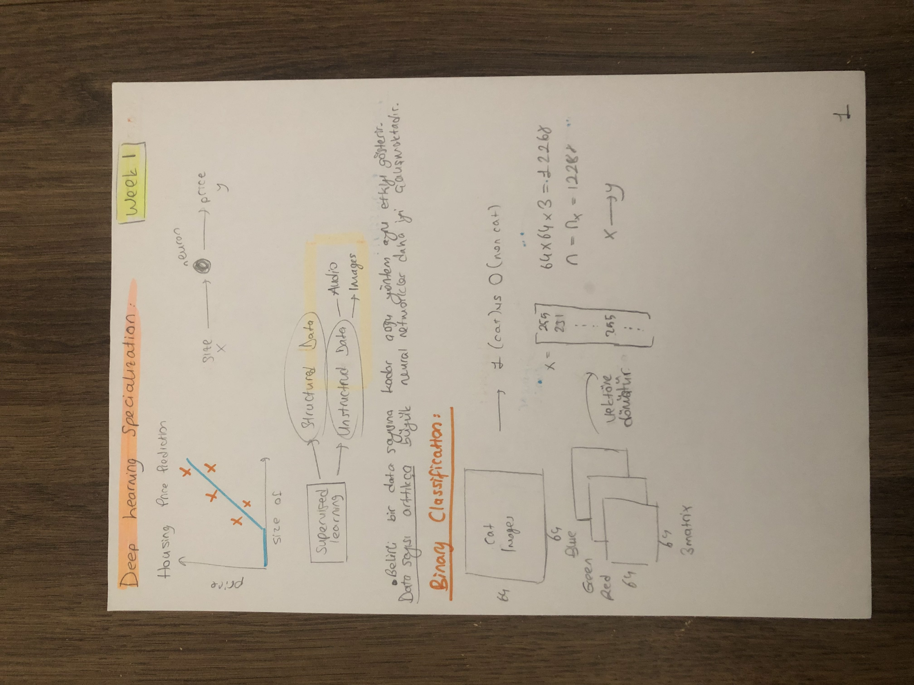
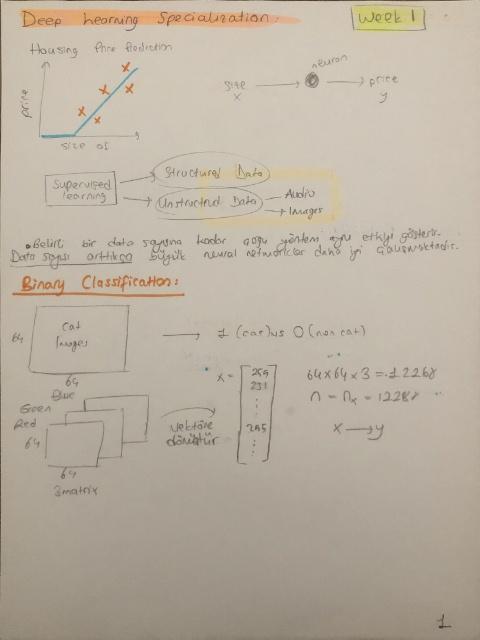

# Welcome to my Document Scanner Model repository

 This project uses the latest techniques in image processing and machine learning along with OpenCV library to accurately scan and digitize documents. The model is trained on a dataset of scanned documents and can be used to scan and digitize any type of document.

## RESULTS
 
